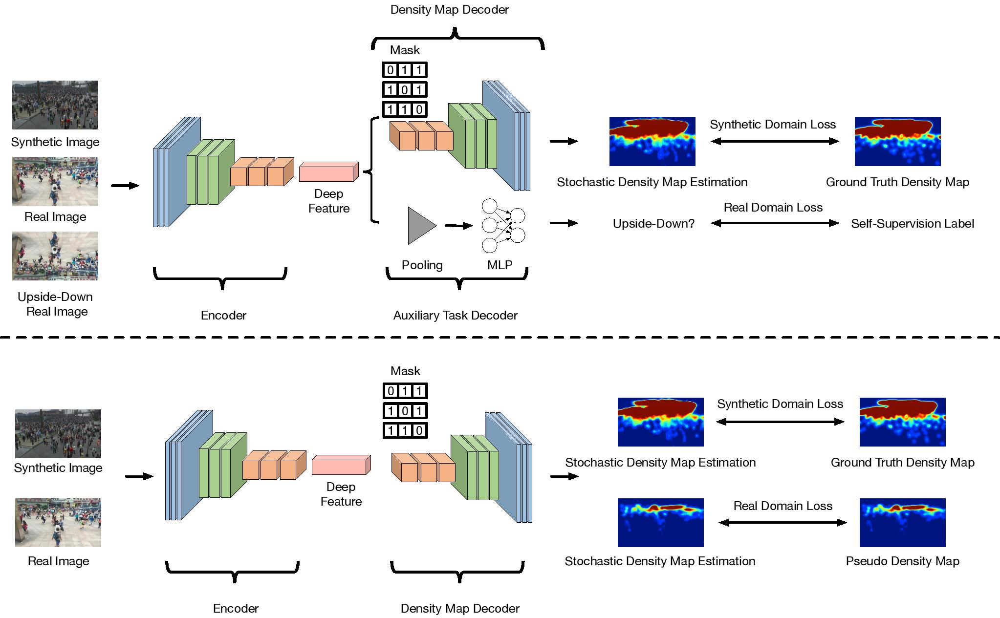

# Code for "Leveraging Self-Supervision for Cross-Domain Crowd Counting" (CVPR 2022)

This repository is a PyTorch implementation for the paper **Leveraging Self-Supervision for Cross-Domain Crowd Counting**, which is accepted as **oral** presentation at CVPR 2022. If you use this code in your research, please cite
[the paper](https://arxiv.org/pdf/2103.16291.pdf).


## Abstract
State-of-the-art methods for counting people in crowded scenes rely on deep networks to estimate crowd density. While effective, these data-driven approaches rely on large amount of data annotation to achieve good performance, which stops these models from being deployed in emergencies during which data annotation is either too costly or cannot be obtained fast enough.

One popular solution is to use synthetic data for training. Unfortunately, due to domain shift, the resulting models generalize poorly on real imagery. We remedy this shortcoming by training with both synthetic images, along with their associated labels, and unlabeled real images. To this end, we force our network to learn perspective-aware features by training it to recognize upside-down real images from regular ones and incorporate into it the ability to predict its own uncertainty so that it can generate useful pseudo labels for fine-tuning purposes. This yields an algorithm that consistently outperforms state-of-the-art cross-domain crowd counting ones without any extra computation at inference time.



Figure 1: **Two-stage approach**. **Top:** During the first training stage, we use synthetic images, real images, and flipped versions of the latter. The network is trained to output the correct people density for the synthetic images and to classify the real images as being flipped or not. **Bottom:** During the second training stage, we use synthetic and real images. We run the previously trained network on the real images and treat the least uncertain people density estimates as pseudo labels. We then fine tune the network on both kinds of images and iterate the process.


## Implementation

Coming soon.


 
## Citing

``` 
@InProceedings{Liu_2022_CVPR,

author = {Liu, Weizhe and Durasov, Nikita and Fua, Pascal},

title = {Leveraging Self-Supervision for Cross-Domain Crowd Counting},

booktitle = {The IEEE Conference on Computer Vision and Pattern Recognition (CVPR)},

month = {June},

year = {2022}

}

``` 


## Contact

For any questions regard this paper/code, please directly contact [Weizhe Liu](mailto:weizheliu1991@163.ch).

